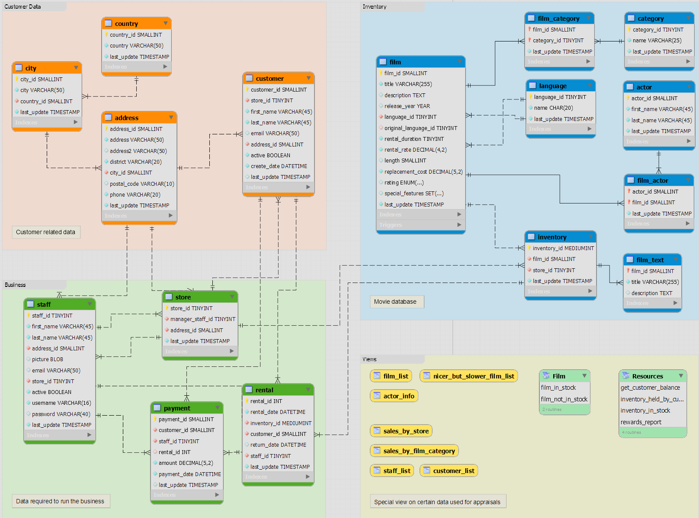

# Hello! My name is Tori Tomlinson  
---  
I am an aspiring Data Analyst with beginner experience in SQl, Excel, Python, and Tableau.  
## Education 
---
I have a bachelors of science in Applied Mathematics from UC Davis. 

During my time at UC Davis, I took courses in Real Analysis and Numerical Analysis that taught me mathematical logic and problem solving. These classes were also quite challenging, so I often worked within groups to solve many challenges and seeked out many resources on my own to solve many problems.  


After I graduated, I took some online courses through UC Davis Coursera.

I took a course in Visual Analytics in Tableau. I created many different styles of graphs to visualize data in a simple yet effective way. I also made interactive dashboards where end users can find more information from areas of interest. I have uploaded a few visualizations on a public profile which is all here: [TableauProfile](https://public.tableau.com/app/profile/victoria.tomlinson/vizzes). 

The other course that I took was SQL for Data Science.

I learned the basics of SQL and simple quieries. I have worked with a sample database called the Chinook database to extract data and transform the data into a table that displays relevant data to answer many example questions.  

## Projects 
---
### SQL Sakila 
---
The Sakila database is a free database that I have worked with to practice MySQL.  
Below is the EER diagram for the Sakila Database.  



```sql
SELECT
    CONCAT('$',amount) AS 'Payment Amount',
    DATE_FORMAT(payment_date, "%d/%m/%Y") AS 'Payment Date'
FROM payment LIMIT 20;
```

